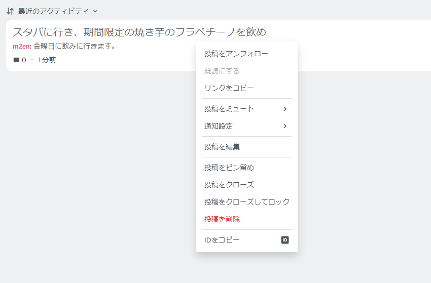
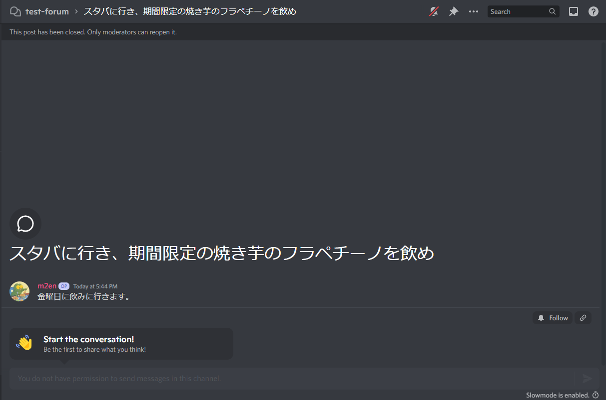

# フォーラムチャンネル

!!! note "使い方"

    フォーラムチャンネルの使い方については公式ヘルプ記事をご確認ください。(英語)

    [Forum Channels FAQ - Discord ヘルプセンター](https://support.discord.com/hc/en-us/articles/6208479917079)

## モデレーション

### 投稿を削除する

投稿の右クリックメニューから **投稿を削除** を選択します。

!!! warning

    削除された投稿は取り戻すことはできません。

### 投稿をクローズする

投稿の右クリックメニューから **投稿をクローズ** を選択します。

この場合、投稿は **過去の投稿** として、フォーラムチャンネルの下に移動しますが、メンバーが自由に解除してまた議論を展開することができます。

### 投稿をロックする

投稿の右クリックメニューから **投稿をクローズしてロックする** を選択します。

通常のクローズとは異なりメンバーが自由に解除することができず、解除することができるのはモデレーターのみになります。(過去ログは見えます。)

!!! warning

    何も知らないモデレーターがメッセージを送ると自動的に解除されます。

    メンバーの暴走でロックした投稿については周知しておきましょう。

## 投稿をピン留めする

投稿をピン留めするには右クリックメニューから **投稿をピン留めする** を選択します。

ピン留めされた投稿は投稿リスト上部に表示され続けます。

!!! note

    ピン留めできる投稿は一個までです。

## 投稿のタグを編集する

投稿のタグを編集するには右クリックメニューから **タグを編集** から適切なタグを選択します。
