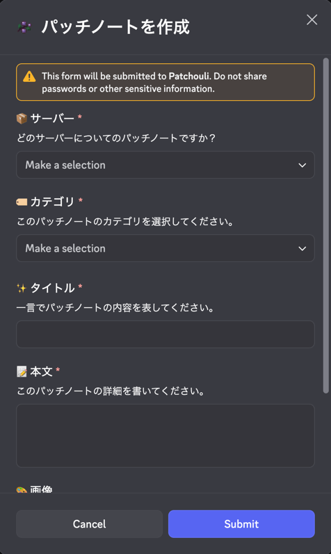

# パッチノート

各サーバーのアップデートや修正内容は、パッチノートを通してユーザーに広く発信します。

## 掲載される場所

- 💬 公式Discordのパッチノートチャンネル (従来通り)
- 🌐 公式サイト

## パッチノートの作成手順

パッチノートの作成には、運営Discordで`/patch-note publish`コマンドを使用します。
コマンドを実行すると、作成画面が表示されるので、必要な情報を入力します。

### 📦 サーバー

| 選択肢         | 運営Discord | 必要なロール           |
|-------------|-----------|------------------|
| 全サーバー       | アジ鯖運営①    | 統括開発者            |
| CreativePro | アジ鯖運営②    | 運営 (CreativePro) |
| Frontier    | アジ鯖運営②    | 運営 (Frontier)    |
| Life        | アジ鯖運営①    | 運営 (Life)        |
| LGW2        | アジ鯖運営①    | 運営 (LGW)         |
| Sclat       | アジ鯖運営②    | 運営 (Sclat)       |

### 🏷️ カテゴリ

| 選択肢     | 用途                              |
|---------|---------------------------------|
| 🔧 バランス | ゲームバランスの調整。                     |
| ✨ 新機能   | 新しい要素を追加。                       |
| 🐛 バグ修正 | 不具合の修正。                         |
| 📈 改善   | 既存の機能の改善。大規模な場合には`✨ 新機能`の使用を推奨。 |

### ✨タイトル

このパッチノートで適用される変更を、一言で簡潔に表現することが望まれます。

冒頭には、「`[fix]`」や「`[new]`」のような接頭辞はつけません。
変更の種別は「🏷️ カテゴリ」で指定してください。

また、通常末尾には、句点（。「マル」）を使用しません。

### 📝 本文

変更の詳細を書きます。マークダウンで装飾が可能です。

### 🖼️ 画像

画像ファイルを最大10枚まで添付できます。
ユーザーが変更点を直感的に理解できるよう、必要に応じて添付することが推奨されます。

## パッチノートの削除手順

パッチノートを誤って作成してしまった場合、`/patch-note unpublish {id}`で削除が可能です。
IDは、作成時のメッセージに記載されます。

なお、削除には作成と同様に権限が必要です。
