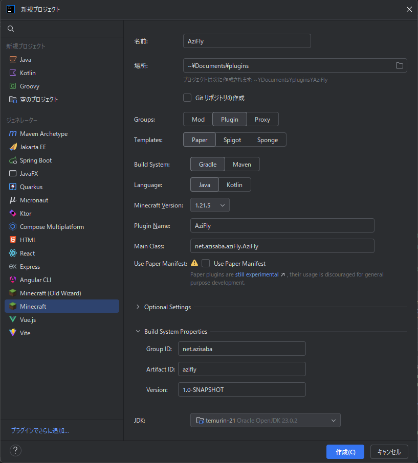

# 2. プロジェクトを作成する

## 前提条件

[環境構築編](https://adminresources.azisaba.net/plugin-development/1-preparing-environment/) を読み終え、環境構築が済んでいることが前提です。

## 手順

1. 新規プロジェクト（またはファイル｜新規プロジェクト）をクリックする。
2. 以下のような画面が出てくるので、左のタブを少しスクロールして`Minecraft`を選択する。（出てこない場合は拡張機能のインストールができていません。[環境構築編へ](https://adminresources.azisaba.net/plugin-development/1-preparing-environment/)）
3. プラグイン名を入力します。ここでは`AziFly`という名前にしました。
4. Groupsは`Plugin`、Templatesは`Paper`を選択し、少し下のGroupIDを入力します。( [GroupIDとは？](#groupidとは) )
5. JDKも選択します。JDKがない場合はインストールしてください。( [JDKとは？](#jdkとは) )
  

## 早速プログラムを書こう！

## よくある質問

### GroupIDとは？
JavaのGroupIDとは制作元などを識別するために使うユニークなIDのことで、任意に設定可能です。  
ドメインを逆にしたものにするのが一般的で、アジ鯖では`net.azisaba`を使用しています。ドメインを持っていない人は、自分のメールアドレスにしておくと良いでしょう。(例えば`com.gmail.〇〇`など)

### JDKとは？
JDK (Java Development Kit) は、Javaでソフトウェア開発を行うために必要なツールをまとめたパッケージです。要するに開発キットのことで、これがないとJavaアプリケーションを作成できません。