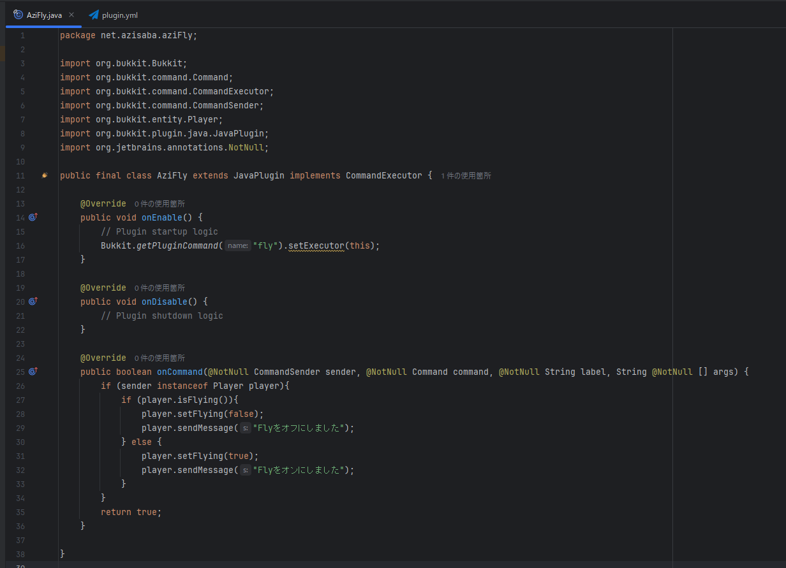
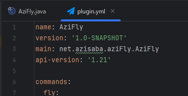

# 3. プログラムを書こう！

今回は、コマンドを打つと、サバイバルでも空を飛べるようになるプラグインを作ります。  
`AziFly.java`を編集します。  
  
プラグインの読み込み時に、`fly`コマンドを登録します。  
```java
@Override
public void onEnable() {
    // Plugin startup logic
    Bukkit.getPluginCommand("fly").setExecutor(this);
}
```

コマンドを打ったときに、プレイヤーを飛行状態にするコードを書きます。
```java
player.setFlying(true); // プレイヤーを飛行状態にする
player.sendMessage("Flyをオンにしました"); // プレイヤーにメッセージを送る
```
 


  
  
最終的にはこんな感じになりました。  
  
`plugin.yml`には    
    
と書きます。  

## ビルド(コンパイル)
作ったプログラムはビルド(コンパイル)という作業を通して初めて実行可能になります。  

右上の再生マークのようなものをクリックすると、ビルドが始まります。 

## ビルドボタンが押せない人へ
ボタンのすぐ左にある「現在のファイル」→「構成の編集」→「新規追加」→「Gradle」→ 実行のタスクと引数に「build」と記入してOKを押す

## サーバーを起動しよう
サーバーの`plugins`フォルダに.jarファイルを入れて起動すれば完了！
