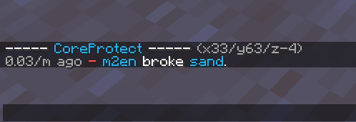
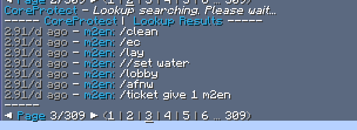

# CoreProtect

CoreProtectは全プレイヤーの行動を細かく保存し、ログとしてデータベースに管理できるプラグインです。

- [GitHub - PlayPro/CoreProtect](https://github.com/PlayPro/CoreProtect/)
- [CoreProtect Documentation](https://docs.coreprotect.net/)

## CoreProtectを採用しているサーバー
(2022/07/31現在)
- Life
- Despawn
- ばにらいふ!
  - TSL
- Afnw
- JunkGames

## Inspector(インスペクター)

`/co i` (or `/co inspect`) で使えるモード。

Inspectorモードが有効になっている間、ログを確認したい地点のブロックを叩いたり、ブロックを置いたりすると、その地点のログを表示します。

## Lookup(ルックアップ)

`/co lookup` (or `/co l`) で使えるモード。

Inspectorとは違い、ログを正確に検索することができます。

Inspectorモードでは調べられない場所や範囲を広げて検索するときに役立ちます。

| コマンド | パラメーター |
| ---- | ---- |
| `/co lookup` | `u:<user> t:<time> r:<radius> a:<action> i:<include> e:<exclude>` |
| `/co l` | `/co lookup <params>` |

## Rollback(ロールバック)

`/co rollback` (or `/co rb`)で使用できるモード。

ブロックの破壊や設置、エンティティの殺害、チェストからの物の入れ出しなどをデータベースから参照し、ロールバック つまりなかったことにすることができます。

このモードは慣れるまで難しく、慣れていないと関係のない部分までロールバックしてしまうおそれがあるので、自分でサーバーを立てて練習することをおすすめします。

ロールバックするとInspector・Lookupで参照するログには横線が入り、操作が行われたことがわかるようになっています。

| コマンド | パラメーター |
| ---- | ---- |
| `/co rollback` | `u:<user> t:<time> r:<radius> a:<action> i:<include> e:<exclude>` |
| `/co rb` | `/co rollback <params>` |

## Restore(リストア)

`/co restore` (or `/co rs`) で使用できるモード。

ロールバックを取り消したり、ロールバックしてしまった部分の復元を行うことができます。

| コマンド | パラメーター |
| ---- | ---- |
| `/co restore` | `u:<user> t:<time> r:<radius> a:<action> i:<include> e:<exclude>` |
| `/co rs` | `/co restore <params>` |

## Purge(パージ)

古いログをパージ(削除)します。古いデータを使用しない場合、ストレージの空き容量を確保するのに便利です。

| コマンド | パラメーター |
| ---- | ---- |
| `/co purge` | `t:<time> r:<world>` |

ゲーム内(Minecraft)で使用した場合は**30日以上前のデータのみ**削除することができ、コンソールから使用した場合は**24時間以上前のデータのみ**を削除することができます。

### ワールドのパージ

CoreProtect v19以上ではオプションでワールドを指定することも可能です。

下の例では**ネザーにある一ヶ月以上前のデータを削除し、他のワールドのデータは削除しません**。

Example: `/co purge t:30d r:#world_nether`

### MySQLの最適化

CoreProtect v2.15以上では、コマンドの最後に `#optimize` を追加することで、テーブルも最適化され、ディスク容量が取り戻されます。

SQLiteのパージはデフォルトでこの最適化を行ってくれるのでこの `#optimize` を使用することが出来るのはデータベースにMySQLを使用しているときのみです。

rollbackなどの操作が遅い場合は `#optimize`　を使用すると操作が軽くなる場合があります。

## Reload

`/co reload`

コンフィグファイルをリロードします。

## Status

`/co status`

CoreProtectの詳細情報を表示します。

## Consumer

`/co consumer`

キューの処理を一時停止、または再開するためのコンソールコマンドです。

## パラメーターの詳細

以下のコマンドではパラメーターで、オプションなどを指定する必要があります。

- `/co lookup`
- `/co rollback`
- `/co restore`
- ( `/co purge` )

### `u:<user>`

プレイヤーを指定することができます。

複数指定することも可能です。

- Example: `u:m2en`
  - この場合は `m2en` というMCIDのログのみを検索します。
- Example: `u:siloneco,takenekooon`
  - この場合は `siloneco`・`takenekooon` というMCIDのログのみを検索します。

### `t:<time>`

週、日、時、分、秒を指定することができます。

時間については `u:<user>` と同じように複数指定(組み合わせ)することができ、小数を使用することも可能です。

- Example: `t:2w,5d,7h,2m,10s`
- Example: `t:5d2h`
- Example: `t:1h-2h`
  - 1時間から2時間の間のログを検索
- Example: `t:2.50h`
  - 2.5時間のログを検索

### `r:<radius>`

プレイヤー位置から半径何ブロック以内を対象にするかを数値で指定します。

サーバー全体で検索したり、ワールドを指定したり、WEの範囲指定で指定した範囲でも検索できます。

- Example: `r:10` 
  - 半径10ブロック以内のログを検索
- Example: `r:#world_the_end`
  - `world_the_end` というワールド名のログを検索
- Example: `r:#global`
  - サーバー全体で検索
- Example: `r:#worldedit` or `r:#we`
  - WorldEditで指定した範囲のログを検索

### `a:<action>`

何のアクションを対象にするかを指定します。

- Example: `a:+block`

| Action(アクション) | 説明 |
| ---- | ---- |
| `a:block` | ブロックの設置・破壊 |
| `a:+block` | ブロックの設置 |
| `a:-block` | ブロックの破壊 |
| `a:chat` | チャット |
| `a:click` | プレイヤーのインタラクション(右クリックなど) |
| `a:command` | コマンド |
| `a:container` | チェストからの物の出し入れ |
| `a:+container` | チェストへの物の投入 |
| `a:-container` | チェストからの物の取り出し |
| `a:inventory` | インベントリからの物の出し入れ |
| `a:+inventory` | インベントリへの物の投入 |
| `a:-inventory` | インベントリからの物の取り出し |
| `a:item` | アイテムの取得、使用など |
| `a:+item` | アイテムの取得など |
| `a:-item` | アイテムのドロップなど|
| `a:kill` | エンティティの殺害 |
| `a:session` | プレイヤーのログイン・ログアウト |
| `a:+session` | プレイヤーのログイン |
| `a:-session` | プレイヤーのログアウト |
| `a:sign` | 看板への記入 |
| `a:username` | ユーザー名(MCID)の変更 |

### `i:<include>` (`b:<block>`)

対象にしたいブロック・アイテム・エンティティを指定します。

複数指定することも可能です。

- Example: `i:stone`
- Example: `i:stone,oak_wood,bedrock`

- [指定できるブロックリスト (Java Edition data values/Blocks)](https://minecraft.fandom.com/wiki/Java_Edition_data_values/Blocks)
- [指定できるエンティティリスト (Java Edition data values/Entities)](https://minecraft.fandom.com/wiki/Java_Edition_data_values/Entities)

### `e:<exclude>`

対象から除外したいブロック・アイテム・エンティティ・ユーザーを指定します。

- Example: `e:tnt`

### `#<hashtag>`

コマンドの末尾にハッシュタグを追加すると、追加のアクションを実行できます。

| ハッシュタグ | 効果 |
| ---- | ---- |
| `#preview` | ロールバック/リストアをプレビュー表示する |
| `#conut` | クエリで見つかった行数を表示する |
| `#verbose` | ロールバック/リストア中に追加情報を表示する |
| `#silent` | ロールバック/リストア中に最小限の情報を表示する |

## コマンドの例

### ロールバック

**注意:** デフォルトでは `radius` が指定されていない場合、半径 `10` としてロールバックされます

- `/co rollback siloneco t:1h`  
  - `siloneco`の1時間以内の活動をロールバックします。
- `/co rollback u:testusuke t:23h17m`  
  - `testusuke`の23時間17分の活動をロールバックします。
- `/co rollback u:Lxl_Luuyk15 t:1h i:stone`  
  - 1時間以内に`Lxl_Luuyk15`が破壊・設置した石ブロックをロールバックします。
- `/co rollback u:ledlaggazi t:1h i:stone a:-block`  
  - 1時間以内に`ledlaggazi`が破壊した石ブロックをロールバックします。
- `/co rollback u:m2en t:1h r:#global e:stone,dirt`  
  - 1時間以内に`m2en`がサーバー全体で破壊・設置した石ブロックと土ブロック以外をロールバックします。
- `/co rollback u:MMLove t:1h r:20`  
  - `MMLove`の1時間以内の活動(半径20ブロック内)をロールバックします。
- `/co rollback u:kusunoki_nya t:1h r:#nether`  
  - `kusunoki_nya`の1時間以内の活動(`nether`というワールドのみ)をロールバックします。
- `/co rollback t:15m r:#worldedit`  
  - WorldEditで指定した範囲の15分間以内の活動をロールバックします。

### 検索

`/co lookup` の引数は一般にロールバックコマンドと同じですが、主な違いはデフォルトの半径がルックアップに適用されません。

つまり、全てのルックアップコマンドはグローバル検索(`#global` と同等)を行うということです。

- `/co lookup i:diamond_ore t:1h a:-block`  
  - 1時間以内のダイヤモンドの鉱石を破壊したログを表示します。
- `/co lookup u:Toto31010 t:30m a:chat`  
  - 30分以内に`Toto31010`が発言したチャットのログを表示します。
- `/co lookup u:_Be4_ t:3d a:inventory`  
  - 3日間以内の`_Be4_`のインベントリのログを表示します。
- `/co lookup u:KotlinLove a:login`  
  - `KotlinLove`のログインのログを表示します。
- `/co lookup u:46kuri_,S1guRe16 a:login`  
  - `46kuri_`・`S1guRe16`のログインのログを表示します。
- `/co lookup u:Nebo_Thunder a:username`  
  - `Nebo_Thunder`のMCID変更履歴を表示します。
