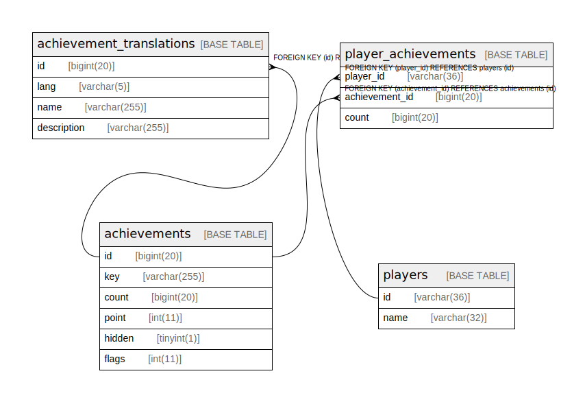

# azisabaachievements

## Tables

| Name | Columns | Comment | Type |
| ---- | ------- | ------- | ---- |
| [achievements](achievements.md) | 6 |  | BASE TABLE |
| [achievement_translations](achievement_translations.md) | 4 |  | BASE TABLE |
| [players](players.md) | 2 |  | BASE TABLE |
| [player_achievements](player_achievements.md) | 3 |  | BASE TABLE |

## Relations

---

> Generated by [tbls](https://github.com/k1LoW/tbls)
