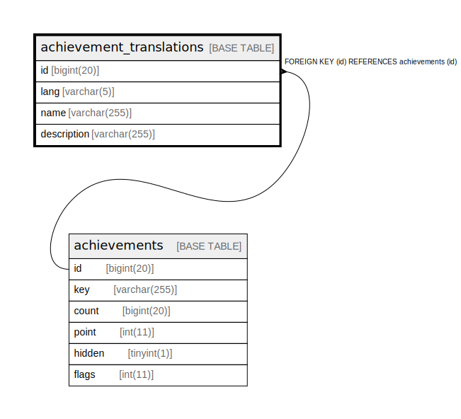

# achievement_translations

## Description

<details>
<summary><strong>Table Definition</strong></summary>

```sql
CREATE TABLE `achievement_translations` (
  `id` bigint(20) NOT NULL,
  `lang` varchar(5) NOT NULL,
  `name` varchar(255) NOT NULL,
  `description` varchar(255) NOT NULL,
  PRIMARY KEY (`id`,`lang`),
  CONSTRAINT `achievement_translations_ibfk_1` FOREIGN KEY (`id`) REFERENCES `achievements` (`id`)
) ENGINE=InnoDB DEFAULT CHARSET=utf8mb4
```

</details>

## Columns

| Name | Type | Default | Nullable | Children | Parents | Comment |
| ---- | ---- | ------- | -------- | -------- | ------- | ------- |
| id | bigint(20) |  | false |  | [achievements](achievements.md) |  |
| lang | varchar(5) |  | false |  |  |  |
| name | varchar(255) |  | false |  |  |  |
| description | varchar(255) |  | false |  |  |  |

## Constraints

| Name | Type | Definition |
| ---- | ---- | ---------- |
| achievement_translations_ibfk_1 | FOREIGN KEY | FOREIGN KEY (id) REFERENCES achievements (id) |
| PRIMARY | PRIMARY KEY | PRIMARY KEY (id, lang) |

## Indexes

| Name | Definition |
| ---- | ---------- |
| PRIMARY | PRIMARY KEY (id, lang) USING BTREE |

## Relations



---

> Generated by [tbls](https://github.com/k1LoW/tbls)
