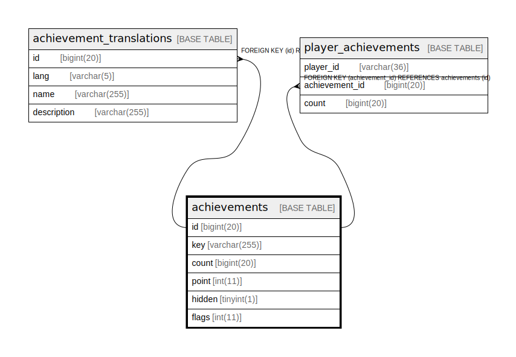

# achievements

## Description

<details>
<summary><strong>Table Definition</strong></summary>

```sql
CREATE TABLE `achievements` (
  `id` bigint(20) NOT NULL AUTO_INCREMENT,
  `key` varchar(255) NOT NULL,
  `count` bigint(20) NOT NULL,
  `point` int(11) NOT NULL,
  `hidden` tinyint(1) NOT NULL DEFAULT 0,
  `flags` int(11) NOT NULL DEFAULT 0,
  PRIMARY KEY (`id`),
  UNIQUE KEY `key` (`key`)
) ENGINE=InnoDB AUTO_INCREMENT=[Redacted by tbls] DEFAULT CHARSET=utf8mb4
```

</details>

## Columns

| Name | Type | Default | Nullable | Extra Definition | Children | Parents | Comment |
| ---- | ---- | ------- | -------- | ---------------- | -------- | ------- | ------- |
| id | bigint(20) |  | false | auto_increment | [achievement_translations](achievement_translations.md) [player_achievements](player_achievements.md) |  |  |
| key | varchar(255) |  | false |  |  |  |  |
| count | bigint(20) |  | false |  |  |  |  |
| point | int(11) |  | false |  |  |  |  |
| hidden | tinyint(1) | 0 | false |  |  |  |  |
| flags | int(11) | 0 | false |  |  |  |  |

## Constraints

| Name | Type | Definition |
| ---- | ---- | ---------- |
| key | UNIQUE | UNIQUE KEY key (key) |
| PRIMARY | PRIMARY KEY | PRIMARY KEY (id) |

## Indexes

| Name | Definition |
| ---- | ---------- |
| PRIMARY | PRIMARY KEY (id) USING BTREE |
| key | UNIQUE KEY key (key) USING BTREE |

## Relations



---

> Generated by [tbls](https://github.com/k1LoW/tbls)
