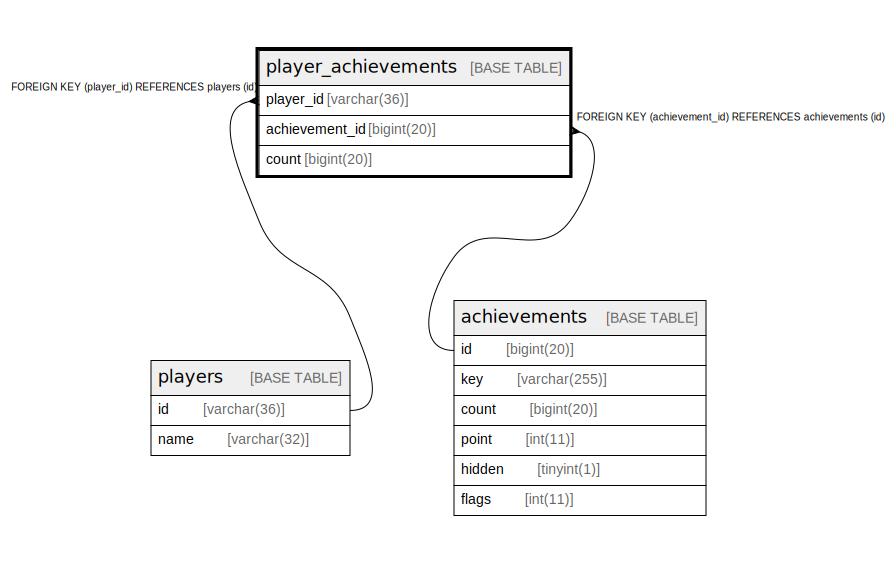

# player_achievements

## Description

<details>
<summary><strong>Table Definition</strong></summary>

```sql
CREATE TABLE `player_achievements` (
  `player_id` varchar(36) NOT NULL,
  `achievement_id` bigint(20) NOT NULL,
  `count` bigint(20) NOT NULL,
  PRIMARY KEY (`player_id`,`achievement_id`),
  KEY `achievement_id` (`achievement_id`),
  CONSTRAINT `player_achievements_ibfk_1` FOREIGN KEY (`player_id`) REFERENCES `players` (`id`),
  CONSTRAINT `player_achievements_ibfk_2` FOREIGN KEY (`achievement_id`) REFERENCES `achievements` (`id`)
) ENGINE=InnoDB DEFAULT CHARSET=utf8mb4
```

</details>

## Columns

| Name | Type | Default | Nullable | Children | Parents | Comment |
| ---- | ---- | ------- | -------- | -------- | ------- | ------- |
| player_id | varchar(36) |  | false |  | [players](players.md) |  |
| achievement_id | bigint(20) |  | false |  | [achievements](achievements.md) |  |
| count | bigint(20) |  | false |  |  |  |

## Constraints

| Name | Type | Definition |
| ---- | ---- | ---------- |
| player_achievements_ibfk_1 | FOREIGN KEY | FOREIGN KEY (player_id) REFERENCES players (id) |
| player_achievements_ibfk_2 | FOREIGN KEY | FOREIGN KEY (achievement_id) REFERENCES achievements (id) |
| PRIMARY | PRIMARY KEY | PRIMARY KEY (player_id, achievement_id) |

## Indexes

| Name | Definition |
| ---- | ---------- |
| achievement_id | KEY achievement_id (achievement_id) USING BTREE |
| PRIMARY | PRIMARY KEY (player_id, achievement_id) USING BTREE |

## Relations



---

> Generated by [tbls](https://github.com/k1LoW/tbls)
